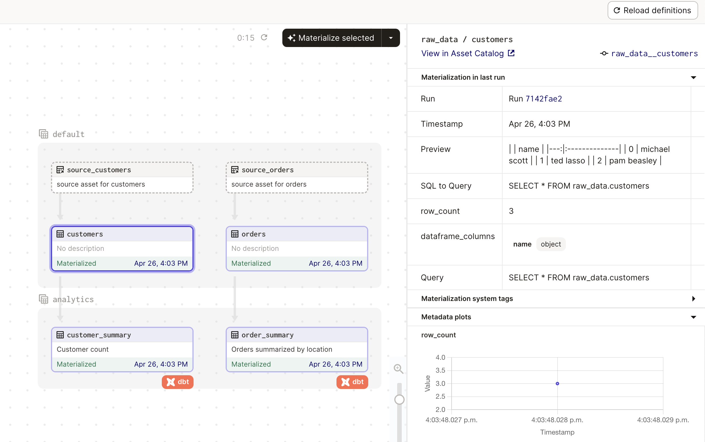

# Event Driven dbt Assets

It is very common for data platforms to have two automation goals:
- track and respond to external events 
- meet stakeholder expectations for fresh data

This project demonstrates how dagster can orchestrate a data platform that meets these goals following an ELT pattern using declarative orchestration patterns.

The data platform manages assets that look like this: 



There are two data sources (`customers` and `orders`) that are updated by external events. Dagster represents these as `SourceAssets`. Dagster runs a job every minute to check if these source assets have been updated. This check could consist of reading a file mtime, pulling events from a Kafka topic, or any check of external state. This job then logs `AssetObservations` for the source asset based on the results of these checks. If a source has new data, Dagster represents this by marking the relevant downstream assets with a "Upstream data" indicator. In this way, Dagster can use an *event driven* paradigm to track sources.

Once an event has been tracked and Dagster is aware of the new upstream data there are two options for how to respond. The rest of the data platform could be updated immediately, or Dagster could wait to incorporate the new upstream data until the stakeholders need it based on their expectations for data freshness.

The first option - respond to the event immediately - is modeled in Dagster by setting an eager `AutoMaterializationPolicy` on the downstream assets. In this project the raw data from the sources is loaded into corresponding tables in the warehouse eagerly. In other words, the assets `orders` and `customers` will be updated as soon as changes are observed in `source_orders` or `source_customers`. 

The second option - waiting until stakeholder SLAs require an update - is modeled in Dagster through a `FreshnessPolicy`. In this project the transformed tables `orders_summary` and `customers_summary` are run every 5 minutes _if_ new source data is available.

## Get Started 

First clone this project and install the dependencies.

```bash
pip install .
```

Next run Dagster and open the web interface:

```bash
dagster dev
```

Navigate to `Deployment` and then `Daemons` and turn on the Auto-materializing daemon. 

At first all of the assets will be un-materialized, and so a run will be launched to fill in the data.

The scheduled job will run every minute and observe the source assets. You can see these asset observations in the asset catalog. Most of the job runs will record the same "data version" indicating that the source data in unchanged. However, if for example you edit the csv file `source_data/orders.csv` then:

1. The job will observe this change and you will see an Asset Observation for `source_orders` with a new "data version".  

2. Dagster will mark the downstream assets `orders` and `orders_summary` with the indicator "Upstream data". 

3. A run will be launched for `orders` right away because it has an eager auto-materialization policy.

4. A run will be launched for `orders_summary` in ~5 minutes to incorporate the changes in accordance to it's freshness policy.

## Development Notes

This project uses a few patterns that are worth calling out. This project has the structure: 

- CSV source data: represented as source assets [`source_orders`, `source_customers`]
- Raw extracted and loaded data: represented as assets [`orders`, `customers`]. The extract and load is done through pandas + IO managers, and the results become a dbt source. The extract is handled by the source asset's IO manager `resources.CSVIOManager.load_input` which creates a pandas dataframe that is then loaded using the asset's IO manager `DagsterDuckDBPandasIOManager.handle_output`
- Transformed data: represented as an asset via the dagster-dbt integration [`orders_summary`, `customers_summary`], transformations done through dbt

> Your project might have a different structure! For example, you might have a system external to dagster doing the extract and load. In that case you would not have the `assets_raw.py`, instead the `dagster-dbt` integration would default to representing dbt sources as source assets automatically! You could still follow the event-driven  pattern of observing data versions for these source assets by using`AssetObservation(key=AssetKey(["my_dbt_source_schema", "my_dbt_source_table"]), ...)` inside of the job used to observe assets.

Because it is common to have many source assets that are extracted and loaded in the same way, this project uses *asset factories* in `assets_raw.py` to dynamically generate the source assets (`source_orders`, `source_customers`) and raw loaded assets (`orders`, `customers`). 


## FAQ 

1. Why not `observable_source_assets`?

One alternative to scheduling a frequent job that creates asset observations would be to use observable source assets. Observable source assets achieve a similar event-driven outcome. However with observable source assets each asset must launch a run to check for updates to themseleves, whereas one job run can create multiple asset observations.

For example, say you are reading from a kafka topic that contains events for multiple source assets. It is convenient to have one job read the event and assign the appropriate asset observation. If instead you used observable source assets, all of the  observable source assets would have to each check the event to see if applied. 

2. Why not sensors?

Sensors are often used in Dagster for event driven workflows. They are a great mechanism for the simple case where you observe an event and then run a pre-defined pipeline. They do not require you to define a separate schedule or launch job runs to check for events.

However, sensors have a few limitations for our desired goals:

- Sensors can only launch runs of pre-defined jobs. For assets this means that sensors could only be used to update an asset job with a pre-defined asset selection. In our example, we want to dynamically decide what assets to update based on the external update we observe.

- Sensors always launch runs, they can't _only_ identify a new data version. (Specifically, sensors yield `RunRequests` only job runs can create `AssetObservations `.) We want our event driven architecture to respond to events by notifying Dagster of new data, not by immediately processing the data. Sensors do not give the flexibility offered by lazy and eager materialization policies or stakeholder SLAs.

- Sensors have to run fast! Sometimes your code that checks for external updates might take longer than 60 seconds to run, and in that case executing the code in a job instead of within a sensor tick is the most robust option.